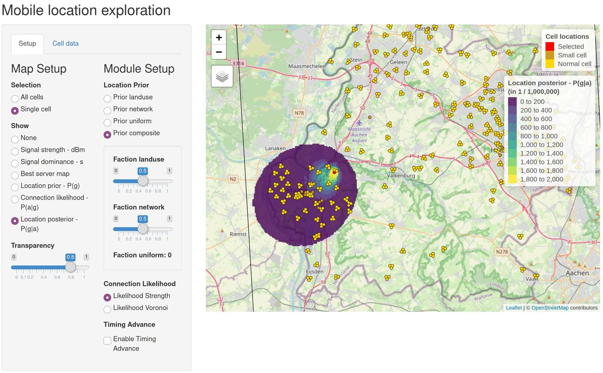

```{r setup, include = FALSE}
knitr::opts_chunk$set(
  collapse = TRUE,
  fig.width=6, 
  fig.height=4,
  comment = "#>"
)
```

The **mobloc** package is used to approximate geographic location given the connection between a mobile device and the cell (an antenna may contain multiple cells). This is done by a physical model of signal strength and a Bayesian method to estimate the location of mobile devices. The latter is done by applying Bayes' formula

$P(g|a) \sim P(g)P(a|g)$

where 

* $P(g|a)$ is the *posterior* probability that a device is located in grid tile $g$ given that it is connected to cell $a$,
* $P(g) is the *prior* probability that a device is located in grid tile $g$. The most simple model is to set it to a constant value. Alternatively, external data sources such as land use can be used.
* $P(a|g)$ is the *likelihood* probability, which is the probability that a device is connected to cell $a$ given that is it located in grid tile $g$. For the computation of these probability, mobloc offers two methods: the first uses Voronoi, which assumes that a device will always be connected to the nearest cell, and the second uses the signal strength model. In a wider context, these probabilities are also called *event location* [3].

These methods are described in detail in [1]. The implementation is described in the documentation of the **mobloc** package [2].


## Processing example data in mobloc

The **mobloc** package contains fictional **cellplan** dataset called `ZL_cellplan`. A cellplan is a dataset that contains the locations and physical properties of the cells from a certain MNO. The cells in `ZL_cellplan` are fictionally placed in the region of Zuid-Limburg, which is NUTS region NL423. Besides the cellplan, other datasets that are contained in **mobloc** are the municipality polygons for Zuid-Limburg `ZL_muni`, the elevation data `ZL_elevation`, and land use data `ZL_landuse`. 

These datasets area loaded as follows.


```{r}
library(mobloc)
data("ZL_cellplan", "ZL_muni", "ZL_elevation", "ZL_landuse")
```

`ZL_cellplan` and `ZL_muni` are **sf** [4] objects of points and polygons respectively. The objects `ZL_elevation` and `ZL_landuse` are **raster** [5] objects.

The following code processes these input datasets. 


```{r}
# set parameters
ZL_param <- mobloc_param()

# create environment layer (needed to calculate path loss exponent (ple))
ZL_envir <- combine_raster_layers(ZL_landuse, weights = c(1, 1, 1, 0, 0))

# validate cellplan
ZL_cellplan <- validate_cellplan(ZL_cellplan, param = ZL_param, region = ZL_muni,
    envir = ZL_envir, elevation = ZL_elevation)

# create raster
ZL_bbox <- sf::st_bbox(c(xmin = 4012000, ymin = 3077000, xmax = 4048000, ymax = 3117000),
    crs = sf::st_crs(3035))
ZL_raster <- create_raster(ZL_bbox)

# compute the signal strength model
ZL_strength <- compute_sig_strength(cp = ZL_cellplan, raster = ZL_raster,
    elevation = ZL_elevation, param = ZL_param)

# create likelihoods (event locations)
ZL_strength_llh <- create_strength_llh(ZL_strength, param = ZL_param)
ZL_voronoi_llh <- create_voronoi_llh(ZL_cellplan, ZL_raster)

# create priors
ZL_uniform_prior <- create_uniform_prior(ZL_raster)
ZL_network_prior <- create_network_prior(ZL_strength, ZL_raster)
ZL_landuse_prior <- create_prior(ZL_landuse, weights = c(1, 1, .1, 0, .5))

# create composite prior: half network, half lansuse
ZL_composite_prior <- create_prior(ZL_network_prior, ZL_landuse_prior, weights = c(0.5, 0.5))

# caculate the posterior distributions
ZL_posterior <- calculate_posterior(prior = ZL_composite_prior, 
    llh = ZL_strength_llh, raster = ZL_raster)
```

This code is explained in the documentation of the **mobloc** package. The most important objects are:

* `ZL_param`, a list that contains all the parameters used in **mobloc**, e.g. the default physical properties of the cells.
* `ZL_raster`, a `raster` object that contains the geospatial information of the grid tiles, e.g. their spatial position and the resolution.
* `ZL_strength`, a `data.table` object that contains the signal strength in `dBm` and the signal dominance (called `s`) per grid tile,
* `ZL_xxx_llh`, `data.table` objects that contain the likelihood probabilities (event locations) per cell. This probability is called `pag`, which stands for `p(a|g)`, which is the probability that a device is connected to cell `a`, given that it is located in grid tile `g`.
* `ZL_xxx_prior`, `raster` objects in the same resolution as `ZL_raster`, that contain prior information. This probability is called `pg`, which stands for `p(g)`, the probability that a device is located in grid tile `g`.
* `ZL_posterior`, a `data.table` that contains the posterior probabilities. This probability is called `pga`, which stands for `p(g|a)`, which is the probability that a device is located in grid tile `g`, given that it is connected to cell `a`.


## Visualization of mobloc parameters

```{r}
library(mobvis)
```

The following function starts a dashboard that examines the parameters used in mobloc.

```{r, eval=FALSE}
setup_sig_strength_model()
```


This tool shows the signal strength model for one cell. 

The left hand side panel shows the settings, which are by default set to values of the list we created with `mobloc_param()`. The plots on the right hand side shows the propagation results. The heatmap on the top right shows the top view of the signal strength of the cell. The direction of directional cells is east in this plot. The four plots below the heatmap can be reproduced with the following single function calls.

The function `distance_plot` plots the relation between signal strength (in dBm) and distance in the propagation direction of the cell. This depends on the cell power in watt (`W`) and the path loss exponent (`ple`) which models how well the signal propagates (2 is free space, 4 is urban area, and is inside buildings).

```{r}
distance_plot(W = 4, ple = 4, range = 2000)
```

The color codes on the y-axis resemble how well the signal is for mobile communication. This will be further discussed later on.

The function `signal_dominance_plot` plots the modeled relation between signal strength (in dBm) and the signal dominance (s).

```{r}
signal_dominance_plot(midpoint = -90, steepness = 0.5)
```


Signal dominance can be interpreted as the quality of a connection between device and mobile phone, or in other words, how attractive it is to make create connection. It is based on the assumption that for a mobile phone network, it is not important whether the connection is good (say -90 dBm) or extreme good (say -70 dBm). When there are multiple cells to choose from, the current capacity is much more important. Likewise, if there is only one available cell for a device to connect to at a certain location, the network will do that, no matter whether the connection is fair (say -100 dBm) or bad (say -120 dBm). This has been modeled by flattening both tails of the distribution. A logistic function has been applied to do this [1], where its parameters are midpoint and steepness.

The function `radiation_plot` plots the modeled radiation pattern from the cell. The radiation pattern indicates how much signal loss there is in the azimuth plane (top view perpendicular to the propagation direction), and the elevation plane (side view perpendicular to the propagation direction). The black contour lines indicate the signal loss as a function of the offset angle. The red points are the -3dB points, i.e. the angle at which the signal loss is 3 dB. The three parameters for this pattern are `type` which indicated whether it is applied to the azimuth (`"a"`) or elevation (`"e"`) place, `beam_width`, which specifies the angle at which the signal loss is 3 dB (so the angle between the red points in the diagram), and `db_back` which defines the signall loss the the angle in the opposite direction of the propagation direction.


```{r, fig.show="hold", out.width="46%"}
radiation_plot(type = "a", beam_width = 60, db_back = -30)
radiation_plot(type = "e", beam_width = 10, db_back = -30)
```


## Visualization of the mobloc output 

The dashboard that examines the processed data from **mobloc** can be called as follows:

```{r, eval=FALSE}
# explore the results
explore_mobloc(
    cp = ZL_cellplan, 
    raster = ZL_raster, 
    strength = ZL_strength,
    priorlist = list(landuse = ZL_landuse_prior, network = ZL_network_prior, uniform = ZL_uniform_prior),
    llhlist = list(Strength = ZL_strength_llh, Voronoi = ZL_voronoi_llh),
    param = ZL_param)
```



In the left-hand-side panel, the user is able to select which raster variable is shown on the map. The options are listed on the left-most column. They are: signal strength (dBm), signal dominance (s), best server map, prior, likelihood, and posterior. For each of them there is a stand-alone function which will be shown and described below. The first option, called "Selection" determines whether the data is shown for all cells or one single cell. In the former case, the maximum number per grid tile is shown. For instance, if the signal strength in dBm is selected for all cells, the color of a grid tile represents the maximum signal strength.

The second column, called "Module Setup" configures the prior, the likelihood, the posterior (which uses the chosen prior and likelihood), and whether Timing Advance is used. 
In the other tab panel, called "Cell data", cellplan data per cell is shown in a table.


### Signal strength and signal dominance

The function `map_sig_strength` is used to map the signal strength or dominance. Which of these two will be shown depends on the `type` argument.

```{r,fig.show="hold", out.width="46%"}
map_sig_strength(rst = ZL_raster, 
                 dt = ZL_strength, 
                 cp = ZL_cellplan, 
                 cells = "BEE_150_N1", 
                 region = ZL_muni, 
                 type = "dBm", 
                 interactive = FALSE)
map_sig_strength(rst = ZL_raster, 
                 dt = ZL_strength, 
                 cp = ZL_cellplan, 
                 cells = "BEE_150_N1", 
                 region = ZL_muni, 
                 type = "dBm", 
                 interactive = FALSE, 
                 settings = mobvis_settings(use_classes = FALSE))
map_sig_strength(rst = ZL_raster, 
                 dt = ZL_strength, 
                 cp = ZL_cellplan, 
                 cells = "BEE_150_N1", 
                 region = ZL_muni, 
                 type = "s", 
                 interactive = FALSE)
map_sig_strength(rst = ZL_raster, 
                 dt = ZL_strength, 
                 cp = ZL_cellplan, 
                 cells = "BEE_150_N1", 
                 region = ZL_muni, 
                 type = "s", 
                 interactive = FALSE, 
                 settings = mobvis_settings(use_classes = FALSE))
```

The function `mobvis_settings()` returns a list that contains settings for the plots drawn by **mobvis**. For instance default color palettes, titles, and whether the plot is static (such as shown here) or interactive (shown in the screenshot of the dashboard tool). The function `mobvis_settings_interactive()` returns the same list, with a few different values, which are aimed for interactive plots. For instance, the cells are by deafult drawn in black in statis maps and yellow with a black border in interactive maps. The function `mobvis_settings_animation()` contains settings for animations, which are described in the other vigentte.

As for signal strength and signal dominance, by default a diverging color palette is shown, from red via yellow to blue, which qualifies the signal strength/dominance as more or less as follows: red is bad, orange is poor, yellow is fair, green is good, and blue is excellent. The mappings (so which values are bad, poor, etc.) can be adjusted via `mobvis_settings`. There is also a setting that disables these classes, which is in the maps on the right hand side.

### Prior, likelihood and posterior

The prior, likelihood and posterior can be shown with the functions `map_pg`, `map_pag`, and `map_pga` respectively.

```{r,fig.show="hold", out.width="46%"}
map_pg(rst = ZL_composite_prior,
       cp = ZL_cellplan,
       region = ZL_muni,
       interactive = FALSE)
map_pag(rst = ZL_raster,
        dt = ZL_strength_llh,
        cp = ZL_cellplan,
        cells = "BEE_150_N1",
        region = ZL_muni,
        interactive = FALSE)
map_pga(rst = ZL_raster,
        dt = ZL_posterior,
        cp = ZL_cellplan,
        cells = "BEE_150_N1",
        region = ZL_muni,
        interactive = FALSE)
```

Note that in these functions, the prior is a `raster` object (parameter `rst`) whereas the likelihood and the posterior are `data.table`s (parameter `dt`). The reason of these formats is that the prior distribution is defined on the level of grid tile; recall that the notation is P(g). The other two, the likelihood (event location) and posterior distribution, are defined per grid tile per cell, in mathematical notation P(a|g) and P(g|a) respectively.

## References

1. Tennekes, Gootzen, Y.A.P.M., Shah, S.H. (2020) A Bayesian approach to location estimation of mobile devices from mobile network operator data, working paper, Statistics Netherlands, Heerlen.
2. Tennekes, M. (2020) mobloc: mobile location algorithms and tools, R-package
3. Salgado, D. et al. (2018) Proposed elements for a methodological framework for the production of official statistics with Mobile Phone Data, ESSnet Big Data, WP5, Deliverable 5.3, Eurostat.
4. Pebesma, E., 2018. Simple Features for R: Standardized Support for Spatial Vector Data. The R Journal 10 (1), 439-446, https://doi.org/10.32614/RJ-2018-009
5. Robert J. Hijmans (2020). raster: Geographic Data Analysis and Modeling. R package version 3.3-13. https://CRAN.R-project.org/package=raster
